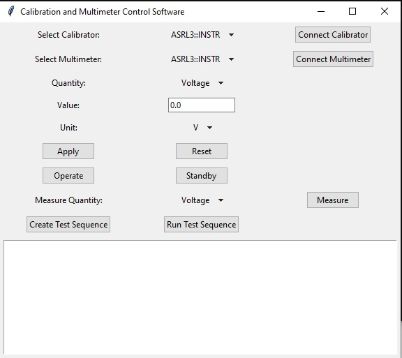
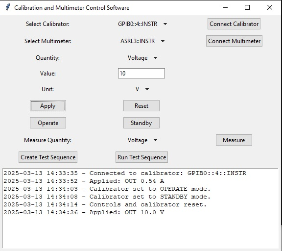

# Calibration and Multimeter Control Software

This software provides a GUI-based solution to interface with calibration and measurement instruments using VISA communication.

## Screenshots

### Start Screen



### Connected


## Features
- Connect to VISA-compatible calibrators and multimeters.
- Set and apply calibration values.
- Perform measurements.
- Create and execute test sequences using Excel.

## Installation
```bash
pip install -r requirements.txt
